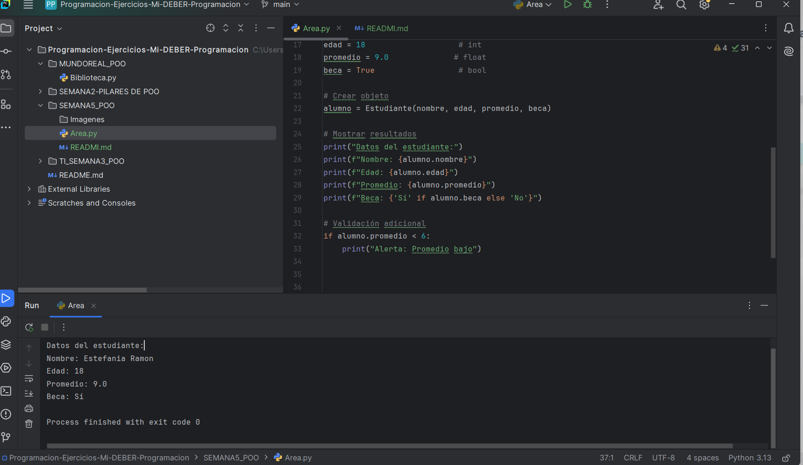

# Programa de Registro de Estudiantes

Este proyecto es un programa simple en Python que permite gestionar información básica de estudiantes utilizando programación orientada a objetos (OOP). 

## Descripción

El programa define una clase `Estudiante` que almacena los siguientes datos:
- **Nombre**: El nombre completo del estudiante.
- **Edad**: La edad del estudiante en años.
- **Promedio**: El promedio académico del estudiante (entre 0.0 y 10.0).
- **Beca**: Un valor booleano que indica si el estudiante tiene una beca.

El programa crea un objeto de la clase `Estudiante` con valores predefinidos y muestra la información del estudiante en la consola.

## Características

- Uso de tipos de datos: `str`, `int`, `float`, `bool`.
- Validación simple del promedio para alertar si es bajo.
- Salida clara y formateada de la información del estudiante.

## Ejemplo de Uso

El programa incluye un ejemplo con los siguientes datos:

- **Nombre**: Estefania Ramon
- **Edad**: 18
- **Promedio**: 9.0
- **Beca**: Sí

Al ejecutar el programa, se mostr ⬤

## AUTOR
Diana Estefania Ramón

## Captura de pantalla del código

